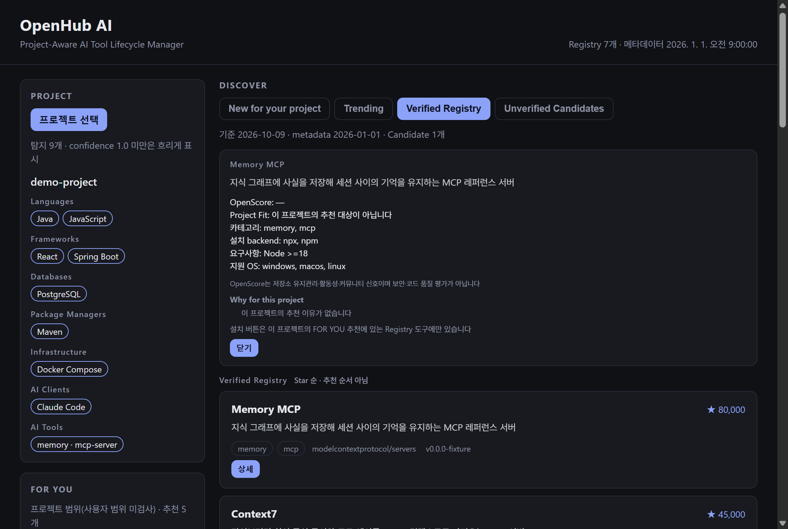

# OpenHub AI

OpenHub AI는 AI 코딩 도구를 위한 오픈소스 프로젝트 맞춤 lifecycle 관리자입니다. 프로젝트를 읽고 맞는 MCP 서버·agent 도구를 추천하며, 설치·확인·업데이트·롤백을 하되 무엇이든 실행하기 전에 사용자가 계획을 승인합니다.

## 데모



`pnpm demo`는 포함된 [데모 프로젝트](examples/demo-project/)(React + Spring Boot + PostgreSQL + Claude Code)로 전체 흐름을 보여 줍니다: Analyze → Existing tools → Recommend → Install preview → Adopt → Releases → Impact → Update preview → Discover → Benchmark preview. fixture 데이터만 쓰고 네트워크 요청·프로세스 실행이 없습니다. Install·Update·Benchmark는 계획까지만 보여 주고 데모가 승인을 거절합니다.

## 왜 OpenHub인가

AI 코딩 도구는 찾기 쉽지만 제대로 유지하기는 어렵습니다. OpenHub는 특정 프로젝트에 대해 세 가지 질문에 답합니다.

1. 이 프로젝트에 무엇이 필요하고, 무엇이 이미 설정되어 있는가?
2. 이 도구가 이 Client·이 PC에서 실제로 동작하는가?
3. 설치 후 업데이트·롤백까지 안전하게 유지할 수 있는가?

OpenHub는 앱 스토어가 아닙니다. 검토된 Registry에서 추천하고 모든 추천 이유를 설명하며, 추천·release note·점수를 실행 허가로 취급하지 않습니다.

## 핵심 기능

- **프로젝트 분석**: manifest와 설정 파일로 언어·프레임워크·DB·인프라·AI Client를 찾습니다. 읽기만 하고 프로젝트의 어떤 것도 실행하지 않습니다.
- **추천**: 이 프로젝트의 capability gap을 Project Fit 순으로 보여 주고 **OpenScore**를 따로 표시합니다. OpenScore는 저장소 유지관리·활동성·커뮤니티 신호이며 보안·코드 품질 평가가 아닙니다.
- **설치**: Claude Code·Codex·Cursor용 npx·uvx·Docker backend. 필요한 설정 항목만 고치고 승인할 plan digest를 보여 줍니다.
- **Lifecycle**: Version State, artifact lock, MCP Health Check, Health가 실패하면 되돌리는 업데이트, 별도 승인을 받는 이전 revision 롤백.
- **Adopt**: 이미 설정한 MCP 서버를 설정 파일을 바꾸지 않고 관리 대상으로 등록합니다.
- **Release 정보**: release notes, 결정론 요약(Breaking·Security·Compatibility·Performance·Fix·Other), 업데이트 영향 판정. 선택형 AI Summary는 표시 전용입니다.
- **Discover**: New for your project·Trending·Verified Registry·Unverified Candidates. Trending은 과거 star 증가율이 아니라 현재 popularity와 최근 release·저장소 활동을 조합한 결정론 점수이며 보안·코드 품질을 평가하지 않습니다. Candidate는 UNVERIFIED 초안이고 설치·Adopt·업데이트할 수 없습니다.
- **Benchmark**: 승인 후 MCP 서버를 6번 실행해 시작·initialize·tools/list 시간을 잽니다. tool은 호출하지 않습니다.

## 동작 방식

Discover → Recommend → Install → Verify → Update → Rollback

1. **Discover**: 프로젝트 scanner가 근거가 붙은 profile을 만들고 Registry·catalog가 후보를 제공합니다.
2. **Recommend**: gap을 Registry 도구와 맞추고 설명합니다. 설치된 도구는 이름과 package로 식별합니다.
3. **Install**: 계획에 정확한 명령, 쓰는 설정 파일, 필요한 승인이 나옵니다. 대화형 터미널이나 데스크톱 네이티브 대화상자에서 승인합니다. 실행 직전에 계획을 다시 만들고 달라졌으면 `PLAN_STALE`로 멈춥니다.
4. **Verify**: Prepared·Configured·Detected 상태와, 격리된 임시 디렉터리에서 서버를 실행하는 MCP Health Check.
5. **Update**: 새 버전을 확정·고정하고 설정 항목을 교체한 뒤 Health Check를 통과해야만 Version State를 바꿉니다. 실패하면 이전 설정으로 되돌립니다.
6. **Rollback**: 별도 계획·승인으로 이전 revision으로 돌아갑니다.

## 빠른 시작

요구 사항: Node.js 24.15 이상. 쓸 backend(npx·uvx·Docker)가 PATH에 있어야 합니다.

release 패키지로 CLI를 설치하고 프로젝트를 확인합니다.

```sh
npm install -g ./openhub-ai-0.1.1.tgz
openhub --version
openhub registry list
openhub project scan ./my-project
openhub project recommend ./my-project
openhub doctor
```

데스크톱: release에서 Windows x64 설치 파일이나 Linux x64 AppImage를 받습니다. Windows 설치 파일은 **서명되지 않아** Windows SmartScreen·Smart App Control 경고가 나올 수 있습니다. macOS release artifact는 없으며 macOS에서는 소스로 빌드할 수 있습니다([지원 플랫폼](docs/supported-platforms.md)).

소스에서:

```sh
pnpm install
pnpm test
pnpm openhub project scan examples/demo-project
pnpm demo
pnpm desktop
```

## 지원 Client와 Backend

| | 지원 |
| --- | --- |
| AI Client | Claude Code, Codex, Cursor(프로젝트·사용자 범위) |
| 설치 backend | npx, uvx, Docker, OpenHub가 생성한 script용 Pinokio |
| 플랫폼 | Windows x64(NSIS 설치 파일, 서명 없음), Linux x64(AppImage), macOS는 소스 빌드만 |

Pinokio 지원은 pterm 0.0.25 기준입니다. 기본 테스트는 가짜 pinokiod를 쓰고 실제 Pinokio 연동은 OPENHUB_E2E=1일 때만 실행합니다. OpenHub는 제3자 Pinokio script를 실행하지 않고 보여 주기만 합니다.

## 보안과 승인 모델

- 모든 변경은 계획 → 사람의 승인 → 실행 직전 계획 재확인을 거칩니다. `--yes`나 자동 승인 옵션은 없습니다.
- 명령은 shell 없이 고정된 실행 파일과 인자 목록으로 실행합니다. 설정 수정은 필요한 항목만, 원자적으로 하고 실패하면 되돌립니다.
- 비밀값을 저장하지 않습니다. 환경변수는 이름만 기록하고 token을 계획·결과·로그·cache에 쓰지 않습니다.
- 사용자 수준 설정 파일은 `--include-host`를 줄 때만 읽습니다.
- 추천·점수·release note·영향 판정·AI Summary·Discovery Candidate는 판단 정보이지 승인이 아닙니다.

release 산출물에는 CycloneDX SBOM과 `SHA256SUMS`가 함께 있습니다. Syft는 Linux AppImage·CLI 패키지에서 구성 요소를 찾지 못하고 Electron app.asar 내부를 읽지 못하며, 번들된 JavaScript 의존성은 dependency SBOM이 덮습니다. Windows 실행 파일 branding(OpenHub AI) 때문에 Syft artifact inventory는 Electron 실행 파일을 Electron으로 식별하지 않을 수 있으며, Electron 버전은 dependency SBOM·실행 중 앱·공식 Electron 배포본으로 확인합니다.

[보안 모델](docs/security-model.md), [승인 모델](docs/approval-model.md), [Discovery 신뢰 경계](docs/discovery-trust.md), [LLM 개인정보](docs/llm-privacy.md), [Release 절차](docs/release-process.md)를 참고하세요.

## CLI

| 명령 | 하는 일 |
| --- | --- |
| `openhub project scan <path>` | 근거가 붙은 프로젝트 profile |
| `openhub project recommend <path>` | Project Fit·OpenScore·이유가 있는 추천, 설치하지 않음 |
| `openhub install <toolId>` | 설치 계획 → 승인 → 설치 |
| `openhub adopt <toolId>` | 이미 설정된 도구 등록 |
| `openhub lifecycle status` | Version State·drift·artifact lock·Health |
| `openhub update <toolId>` / `openhub rollback <toolId>` | Health Check와 함께 업데이트·롤백 |
| `openhub releases <toolId>` / `openhub impact <toolId>` | release notes·결정론 요약·업데이트 영향 |
| `openhub discover --view trending` | Discover 화면(new·trending·verified·candidates) |
| `openhub candidate prepare <candidateId>` | 로컬 Registry 기여 패키지, GitHub에 쓰지 않음 |
| `openhub benchmark <toolId>` | 승인 후 시작 시간 측정, tool 호출 없음 |
| `openhub doctor` | 실행 환경·backend·Registry·metadata·Version State 확인 |

모든 옵션은 `openhub --help`로 봅니다.

## 데스크톱

데스크톱 앱은 네 구역입니다: **PROJECT**(폴더 선택·분석), **FOR YOU**(추천·설치 계획), **DISCOVER**(New for your project·Trending·Verified Registry·Unverified Candidates·도구 상세), **INSTALLED**(상태·업데이트·Health Check·롤백·Adopt·Benchmark·release notes·Pinokio 미리보기). 프로젝트를 고르기 전까지 7단계 안내가 보입니다. 승인은 네이티브 대화상자이고 비신뢰 문자열은 일반 텍스트로만 보입니다.

## 아키텍처

TypeScript monorepo입니다. `packages/core`에 분석·Registry·추천·설치·lifecycle·release 로직이 있고 `apps/cli`와 `apps/desktop`(Electron)은 그 위의 얇은 화면입니다. `registry/`에 검토된 Manifest가 있습니다. [아키텍처](docs/architecture.md)와 [문제 해결](docs/troubleshooting.md)을 참고하세요.

## 기여

코드와 Registry 기여를 환영합니다. 개발 환경·테스트·Candidate → Manifest 과정은 CONTRIBUTING.md, 취약점 신고는 SECURITY.md를 보세요.

## 라이선스

MIT. [LICENSE](LICENSE)와 [THIRD_PARTY_NOTICES.md](THIRD_PARTY_NOTICES.md)를 보세요.
